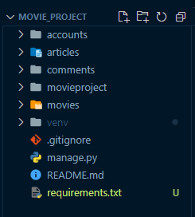
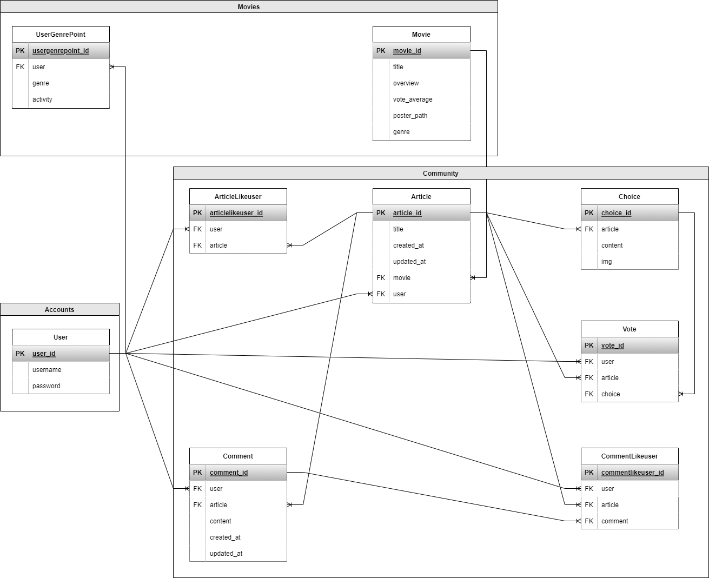
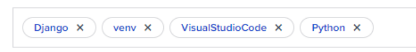
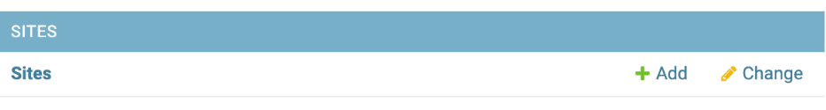
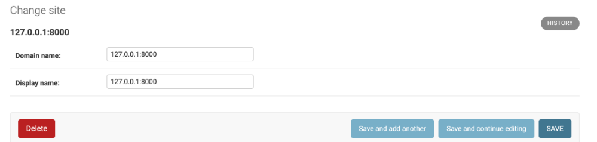
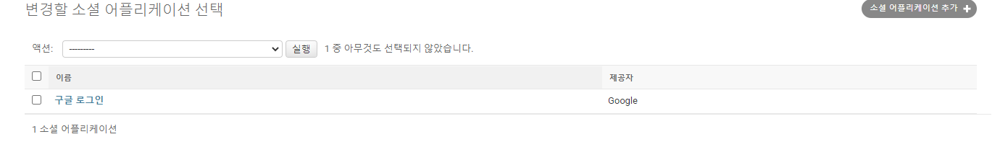
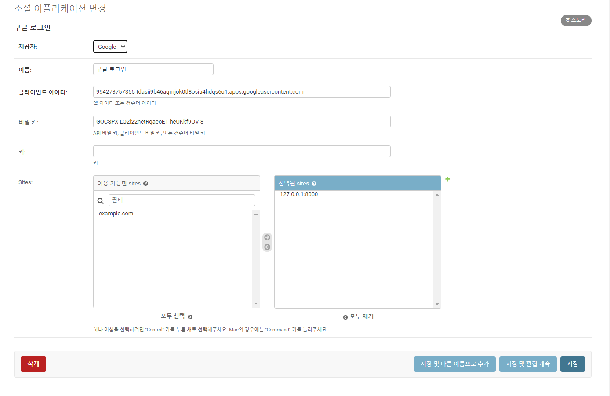

# `fianl-pjt` 진행과정

## `backend` - Django drf

### [0] 프로젝트, 앱 구조, branch 이름 등



* 프로젝트 `movieproject`
  * 앱 
  
    `accounts`  : 사용자 계정 관련 기능
  
    `community` : 게시글, 댓글 등 커뮤니티 기능
  
    `movies` : movie 데이터 처리 기능 


* [DB](https://www.erdcloud.com/d/Ykdt8u3n2YiWNzxems)




* branch 
  * be : 백앤드 branch 
  * be-dev : 백앤드 개발 중인 branch 


---

### [1] 가상환경 설정, 패키지 설치, 프로젝트 시작, gitignore 

``` bash
$ python -m venv venv

$ source venv/Scripts/activate

$ pip install -r requirements.txt

$ pip install django-cors-headers
$ pip install django-allauth
$ pip install dj-rest-auth

$ pip freeze > requirements.txt

$ django-admin startproject movieproject .

$ python manage.py startapp accounts
$ python manage.py startapp community
$ python manage.py startapp movies
$ python manage.py startapp comments

$ touch .gitignore
```

* [gitignoreio](https://www.toptal.com/developers/gitignore/api/django,venv,visualstudiocode,python) 사이트 파일 저장 


### [2] git init, add, branch 설정 (참고 코드)

``` bash
$ git init

$ git add .

$ git commit -m "Init django project"

# branch 확인 
$ git branch

# git branch `브랜치이름`
$ git branch backend

# backend 브랜치로 이동 (backend)
$ git checkout backend
```


### [3] `movieproject > settings.py` 

* INSTALLED_APPS 

``` python
INSTALLED_APPS = [
    # local apps
    'accounts',
    'community',
    'movies',

    # 3rd party apps
    'django_extensions',

    # CORS 세팅
    'corsheaders',

    # rest_framework
    'rest_framework',
    'rest_framework.authtoken', # token기반 auth
    
    # DRF authtoken
    'dj_rest_auth', # signup 제외 auth 관련 담당
    'dj_rest_auth.registration', # signup 담당

    # signup 담당을 위해 필요 
    'allauth',
    'allauth.account',
    'allauth.socialaccount',

    # django native apps
    'django.contrib.sites',
    'django.contrib.admin',
    'django.contrib.auth',
    'django.contrib.contenttypes',
    'django.contrib.sessions',
    'django.contrib.messages',
    'django.contrib.staticfiles',
]
```

* LANGUAGE_CODE, TIME_ZONE

``` python
LANGUAGE_CODE = 'ko-kr'

TIME_ZONE = 'Asia/Seoul'
```

* AUTH_USER_MODEL

``` python
AUTH_USER_MODEL = 'accounts.User'
```

* SITE_ID (`allauth`를 쓰기위해 `django.contrib.sites`에서 사용하는 `SITE_ID`추가)

``` python
SITE_ID = 1
```

* MIDDLEWARE 'corsheaders.middleware.CorsMiddleware' 상단 추가

``` python
MIDDLEWARE = [
    'corsheaders.middleware.CorsMiddleware',
    'django.middleware.security.SecurityMiddleware',
    'django.contrib.sessions.middleware.SessionMiddleware',
    'django.middleware.common.CommonMiddleware',
    'django.middleware.csrf.CsrfViewMiddleware',
    'django.contrib.auth.middleware.AuthenticationMiddleware',
    'django.contrib.messages.middleware.MessageMiddleware',
    'django.middleware.clickjacking.XFrameOptionsMiddleware',
]
```

* CORS_ALLOW_ALL_ORIGINS

``` python
# 모두에게 교차출처 허용 (*)
CORS_ALLOW_ALL_ORIGINS = True
```

* REST_FRAMEWORK (*DRF 인증 관련 설정*)

``` python
# DRF 인증 관련 설정
REST_FRAMEWORK = {
    'DEFAULT_AUTHENTICATION_CLASSES': [
        'rest_framework.authentication.TokenAuthentication',
    ],
    'DEFAULT_PERMISSION_CLASSES': [
        # 모두에게 허용
        # 'rest_framework.permissions.AllowAny', 

        # 인증된 사용자만 모든일이 가능 / 비인증 사용자는 모두 401 Unauthorized
        'rest_framework.permissions.IsAuthenticated'
    ]
}
```


### [4] `admin`

* `accounts > admin.py`

``` python
from django.contrib import admin
from .models import User

admin.site.register(User)
```

* `community> admin.py`

``` python
from django.contrib import admin
from .models import Article, Comment, Vote, Choice

admin.site.register(Article)
admin.site.register(Comment)
admin.site.register(Vote)
admin.site.register(Choice)
```

* `movies > admin.py`

``` python
from django.contrib import admin
from .models import Movie

admin.site.register(Movie)
```


### [5] `urls`

*  `movieproject > urls.py`

``` python
from django.contrib import admin
from django.urls import path, include

urlpatterns = [
    path('admin/', admin.site.urls),
    path('api/v1/comunity/', include('community.urls')),
    path('api/v1/accounts/', include('accounts.urls')),
    path('api/v1/accounts/', include('dj_rest_auth.urls')),

    path('api/v1/movies/', include('movies.urls')),
    path('api/v1/accounts/signup/', include('dj_rest_auth.registration.urls')),
]
```

* `accounts > urls.py`

기본설정

* `community> urls.py`

기본설정

* `movies > urls.py`

기본설정


### [6] models.py

* `accounts > models.py`

``` python
from django.db import models
from django.contrib.auth.models import AbstractUser

class User(AbstractUser):
    pass
```


* `community> models.py`

``` python
from django.conf import settings
from django.db import models
import movies.models

class Article(models.Model):
    user = models.ForeignKey(settings.AUTH_USER_MODEL, on_delete=models.CASCADE, related_name='articles')
    title = models.CharField(max_length=100)
    movie = models.ForeignKey('movies.Movie', on_delete=models.CASCADE, related_name='articles')
    like_user = models.ManyToManyField(settings.AUTH_USER_MODEL, related_name='like_articles')
    created_at = models.DateTimeField(auto_now_add=True)
    updated_at = models.DateTimeField(auto_now=True)
    #content_a = models.TextField()
    #content_b = models.TextField()
    #img_a = models.ImageField(upload_to="", blank=True) # 기본 이미지도 주고 싶은데..
    #img_b = models.ImageField(upload_to="", blank=True) # 기본 이미지도 주고 싶은데..
    
    def __str__(self):
        return self.title

class Comment(models.Model):
    user = models.ForeignKey(settings.AUTH_USER_MODEL, on_delete=models.CASCADE, related_name='comments')
    article = models.ForeignKey(Article, on_delete=models.CASCADE, related_name='comments')
    content = models.CharField(max_length=200)
    # 대댓글 => reply = models.ForeignKey('self', on_delete = models.SET_NULL, null=True)
    created_at = models.DateTimeField(auto_now_add=True)
    updated_at = models.DateTimeField(auto_now=True)

    def __str__(self):
        return self.content


# 투표에 대한 선택
class Choice(models.Model):
    article = models.ForeignKey(Article, on_delete=models.CASCADE, related_name='choices')
    content = models.CharField(max_length=100)
    img = models.TextField()


# 투표 데이터
class Vote(models.Model):
    user = models.ManyToManyField(settings.AUTH_USER_MODEL, related_name='votes')
    article = models.ForeignKey(Article, on_delete=models.CASCADE, related_name='votes')
    chioce = models.ForeignKey(Choice, on_delete=models.CASCADE)
```


* `movies > models.py`

``` python
from django.db import models
import community.models

class Genre(models.Model):
    genre_code = models.IntegerField()
    genre = models.CharField(max_length=100)

    def __str__(self):
        return self.genre


class Movie(models.Model):
    title = models.CharField(max_length=100)
    overview = models.TextField()
    release_date = models.DateTimeField()
    poster_path = models.URLField(null=True, blank=True)
    article = models.ForeignKey('community.Article', on_delete=models.CASCADE, related_name='movies')
    genre = models.ManyToManyField(Genre, blank=True, related_name='movies')
    
    def __str__(self):
        return self.title
```


### [7] makemigrations, migrate, createupseruser

```  bash
$ python manage.py makemigrations

$ python manage.py migrate

$ python manage.py createsuperuser
```


### [8] serializers.py

* `accounts > serializers.py`

``` python
from rest_framework import serializers
from django.contrib.auth import get_user_model
from community.models import Article

User = get_user_model()

class ProfileSerializer(serializers.ModelSerializer):
    class ArticleSerializer(serializers.ModelSerializer):
        class Meta:
            model = Article
            fields = ('pk', 'title', 'content',)
            
    articles = ArticleSerializer(many=True)
    #like_articles = ArticleSerializer(many=True)
    
    class Meta:
        model = get_user_model()
        fields = ('pk', 'username', 'email', 'articles',)

```


* `community> serializers.py`

``` python
from rest_framework import serializers
from django.contrib.auth import get_user_model

from movies.serializers import MovieSerializer
from .models import Article, Comment, Choice, Vote

User = get_user_model()

# 댓글
class UserSerializer(serializers.ModelSerializer):
        class Meta:
            model = User
            fields = ('pk', 'username',)

class CommentSerializer(serializers.ModelSerializer):    
    user = UserSerializer(read_only=True)

    class Meta:
        model = Comment
        fields = ('pk', 'user', 'content', 'article',)
        read_only_fields = ('article', )


# Article C, U, D
class ArticleSerializer(serializers.ModelSerializer):
    comments = CommentSerializer(many=True, read_only=True)
    user = UserSerializer(read_only=True)
    movie = MovieSerializer(read_only=True)
    
    class Meta:
        model = Article
        fields = ('pk', 'user', 'title', 'movie', 'content', 'comments',)
        read_only_fields = ('movie',)


# Article List Read
class ArticleListSerializer(serializers.ModelSerializer):
    user = UserSerializer(read_only=True)
    movie = MovieSerializer(read_only=True)
    # queryset annotate (views에서 채워줄것!)
    comment_count = serializers.IntegerField()
    like_count = serializers.IntegerField()

    class Meta:
        model = Article
        fields = ('pk', 'user', 'title', 'movie', 'comment_count', 'like_count',)
        read_only_fields = ('user', 'movie',)


class ChoiceSerializer(serializers.ModelSerializer):
    article = ArticleListSerializer(read_only=True)
    class Meta:
        model = Choice
        fields = ('article', 'content', 'img',)
        read_only_fields = ('article', )


class VoteSerializer(serializers.ModelSerializer):
    user = UserSerializer(read_only=True)
    article = ArticleListSerializer(read_only=True)
    class Meta:
        model = Vote
        fields = ('user', 'article', 'chioce',)
        read_only_fields = ('user', 'article', 'chioce',)
```


* `movies > serializers.py`

``` python
from rest_framework import serializers
from django.contrib.auth import get_user_model
from .models import Movie, Genre


class GenreSerializer(serializers.ModelSerializer):
    class Meta:
        model = Genre
        fields = ('id', 'genre',)

class MovieSerializer(serializers.ModelSerializer):
    genres = GenreSerializer(many=True)

    class Meta:
        model = Movie
        fields  = ('id', 'title', 'release_date', 'running_time', 'poster_path', 'genres',)
        read_only_fields  = ('article')
        #fields = '__all__'
```


### [9] views.py

* `accounts > views.py`

``` python
from django.shortcuts import get_object_or_404
from django.contrib.auth import get_user_model

from rest_framework import status
from rest_framework.decorators import api_view
from rest_framework.response import Response

from .serializers import ProfileSerializer

User = get_user_model()

@api_view(['GET'])
def profile(request, username):
    user = get_object_or_404(User, username=username)
    serializer = ProfileSerializer(user)
    return Response(serializer.data)
    

@api_view(['POST'])
def signup(request):
    password = request.data.get('password')
    password_confirmation = request.data.get('passwordConfirmation')
    if password != password_confirmation:
        return Response({'error': '비밀번호가 일치하지 않습니다.'}, status=status.HTTP_400_BAD_REQUEST)
    serializer = ProfileSerializer(data=request.data)
    if serializer.is_valid(raise_exception=True):
        user = serializer.save()
        user.set_password(request.data.get('password'))
        user.save()
        return Response(serializer.data, status=status.HTTP_201_CREATED)
```


----

### google auth login 기능

#### [1] movieproject > setting.py

* INSTALLED_APPS 수정 (provider 추가)

``` python
INSTALLED_APPS = [

    #provider 구글 페이스북 카톡 깃허브 등 소셜로그인 제공업체
    'allauth.socialaccount.providers.naver',
    'allauth.socialaccount.providers.google',
]
```

* SITE_ID

``` python
SITE_ID = 1
```

* LOGIN_REDIRECT_URL 추가

``` python
LOGIN_REDIRECT_URL = '/'  # 로그인 후 호출되는 url 지정 부분
```

* AUTHENTICATION_BACKENDS 추가

``` python
 
# Aullauth 관련 settings
AUTHENTICATION_BACKENDS = (
    # 기본 장고 로그인
    'django.contrib.auth.backends.ModelBackend',
    
    # 'allauth' 소셜 로그인
    'allauth.account.auth_backends.AuthenticationBackend',
)
```

* setting.py 수정 후 `python manage.py migrate`


#### [2] movieproject > urls.py

* urlpatterns에 코드 추가 `include('allauth.urls')` 이 부분이 중요
  * path로 요청되면, allauth의 urls.py로 이동할 수 있도록 설정됨

``` python
path('accounts/', include('allauth.urls')),
```


`local에서 할 경우 여기부터 `

#### [3-1] admin site에서 sites 변경






domain name, display name 모두 127.0.0.1:8000으로 변경 후 저장

(`여기서 site는 우리가 소셜 로그인을 사용할 사이트를 의미함`)


#### [3-2] admin site에서 social application 변경





* 제공자 : Google선택
* 이름 : 임의로 사용자가 지정
* 클라이언트 아이디 : 994273757355-tdasii9b46aqmjok0tl8osia4hdqs6u1.apps.googleusercontent.com
* 비밀 키 : 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
* sites : 127.0.0.1:8000 선택 후 저장


#### [4] google login url

http://127.0.0.1:8000/accounts/google/login/
