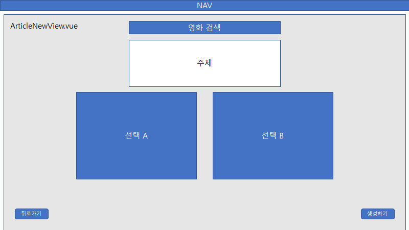
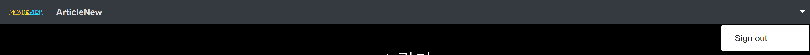
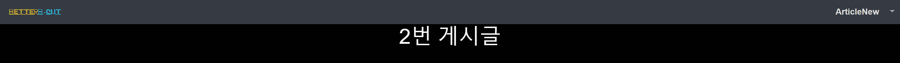
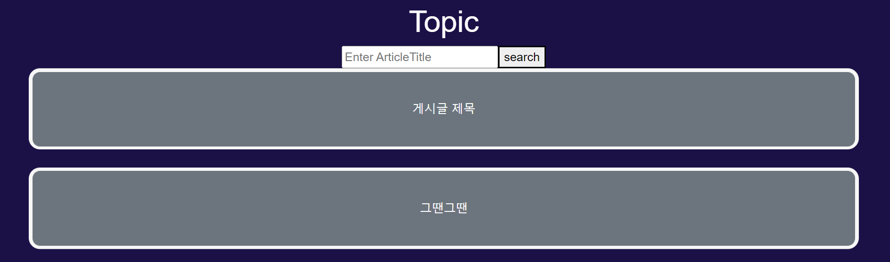

# final_pjt_front

### 0. 최초 화면구성

- 메인 (Home)


-  로그인


- 게시글 생성
  - 게시글: 투표논제, 사용자는 한 영화의 특정 장면 혹은 상황에 대해 새로운 선택지(시나리오)를 제시하고 다른 사용자의 평가를 받는다.



- 게시글 상세


### 1. 프로젝트 시작

- 컴포넌트 구조
- 라우터 사용
- Vuex 사용
- 부트스트랩 사용


### 2. 로고 제작


- LogoIcon.vue

  - 이미지가 아닌 HTML 방식의 로고를 사용해 이를 컴포넌트로 지정하였다.
  - 로고는 네온사인 느낌으로, 기존에는 깜빡이는 애니메이션이 포함되어있었다. 그러나, 범용적으로 사용하기에는 적합하지 않아, 특정 라우트에서만 애니메이션을 추가하기로 하고 기본 로고에서는 제거했다.

```vue
<template>
    <div class="container d-flex justify-content-center">
      <div class="neon"> Movie </div>
      <div class="flux"> Pick </div>
    </div>
</template>

<script>
export default {

}
</script>

<style scoped>
  @font-face {
    font-family: neon;
    src: url(https://s3-us-west-2.amazonaws.com/s.cdpn.io/707108/neon.ttf);
  }

  .container {
    display: inline-block;
    text-align: center;
    vertical-align: middle;
  }

  .neon {
    font-family: neon;
    font-weight: 400;
    color: #FED128;
    font-size: 1.5vh;
    line-height: 5vh;
    /* text-shadow: 0 0 2vh #FED128; */
  }

  .flux {
    font-family: neon;
    font-weight: 400;
    color: #28D7FE;
    font-size: 1.5vh;
    line-height: 5vh;
    /* text-shadow: 0 0 2vh #28D7FE; */
  }
</style>
```


### 3. 네비게이션 바 생성


- NavBar.vue
  - NavBar는 각 `route-link`를 부트스트랩 `navbar`에 포함하여 URL을 이동할 수 있다.
  - 로고를 누르면 `Home`으로 이동한다.

```vue
<template>
  <div>
    <b-navbar type="dark" variant="dark">
      <b-nabvar-brand>
        <router-link :to="{ name: 'articleList'}" class="text-decoration-none"><logo-icon></logo-icon></router-link>
      </b-nabvar-brand>
      <b-navbar-nav>
        <b-nav-item>
          <router-link :to="{ name: 'articleNew'}" class="text-decoration-none ">ArticleNew</router-link>
        </b-nav-item>
      </b-navbar-nav>
      <b-navbar-nav class="ms-auto">
        <b-nav-item>
        <router-link :to="{ name: 'login'}" class="text-decoration-none mr-auto">Login</router-link>
          </b-nav-item>
        <b-nav-item>
          <router-link :to="{ name: 'signup'}" class="text-decoration-none mr-auto">Sign up</router-link>
        </b-nav-item>
      </b-navbar-nav>
    </b-navbar>
  </div>
</template>

<script>
import LogoIcon from '@/components/LogoIcon.vue'

export default {
  name: 'NavBar',
  components: {
    LogoIcon,
  }
}
</script>

<style scoped> 
  nav {
  padding: 2px;
  }

  nav a {
    font-weight: bold;
    color: gainsboro;
  }

  nav a.router-link-exact-active {
    color: gray;
  }
</style>
```


### 4. 회원가입 페이지 생성


- SignupView.vue
  - Sign up은 `b-form`을 이용했고 `username`, `password1`, `password2`를 받아 전송한다.
  - `signup` action을 mapping해 사용한다.
  - Sign up에서는 로고가 크게 드러나기 때문에 하위 컴포넌트의 스타일에 접근할 수 있는 `>>>`를 사용해 로고에 애니메이션을 추가해줬다.
  - 자꾸 발생하는 `401 ERROR`. 데이터에 사용자 정보는 전달이 되나, 확인을 위해 보낸 토큰이 인증받지 못했다. 오류는 역시 오타. 토큰을 실어보내주는 `headers`에 오타가 났다.

```vue
<template>
  <div class="login">
    <div class="block"></div>
    <logo-icon class="logo-in-login"></logo-icon>
    <div class="container bg-light p-4">
      <b-form class="login-form" @submit.prevent="signup(credentials)">
        <div>
          <!-- <label for="username">Username</label> -->
          <b-form-group
            id="username-group" 
            label="Username" 
            label-for="username">
            <b-form-input 
              id="username" 
              v-model="credentials.username" 
              type="text" 
              placeholder="Enter Username"
              required></b-form-input>
          </b-form-group>
        </div>

        <div>
          <b-form-group
            id="password-group"
            label="Password"
            label-for="password" >
            <b-form-input 
              id="password" 
              v-model="credentials.password1" 
              type="password" 
              placeholder="Enter Password"
              required></b-form-input>
          </b-form-group>
        </div>

        <div>
          <b-form-group
            id="password-group-2"
            label="Password Confirmation"
            label-for="password2" >
            <b-form-input 
              id="password2" 
              v-model="credentials.password2" 
              type="password" 
              placeholder="Password Confirm"
              required></b-form-input>
          </b-form-group>
        </div>

        <b-button type="submit">Sign up</b-button>
      </b-form>
    </div>
  </div>
</template>

<script>
import LogoIcon from '@/components/LogoIcon.vue'
import { mapActions } from 'vuex'

export default {
  name: 'LoginView',
  components: {
       LogoIcon,
    },
  data() {
    return {
      credentials: {
        username: '',
        password1: '',
        password2: '',
      }
    }
  },
  computed: {
  },
  methods: {
    ...mapActions(['signup'])
  }
}
</script>

<style scoped>
  .block {
    height: 12vh;
  }

  .login-form {
    color: black;
  }

  .logo-in-login >>> .neon {
    font-family: neon;
    color: #FB4264;
    font-size: 4vh;
    line-height: 10vh;
    text-shadow: 0 0 3vh #F40A35;
  }

  .logo-in-login >>> .flux {
    font-family: neon;
    color: #426DFB;
    font-size: 4vh;
    line-height: 10vh;
    text-shadow: 0 0 3vh #2356FF;
  }

  .logo-in-login >>> .neon {
    animation: neon 3s ease infinite;
    -moz-animation: neon 3s ease infinite;
    -webkit-animation: neon 3s ease infinite;
    -o-animation: flux 3s linear infinite;
  }

  .logo-in-login >>> .flux {
    animation: flux 3s linear infinite;
    -moz-animation: flux 3s linear infinite;
    -webkit-animation: flux 3s linear infinite;
    -o-animation: flux 3s linear infinite;
  }

  @keyframes neon {
    0%,
    100% {
      /* text-shadow: 0 0 .5vw #FA1C16, 0 0 3vw #FA1C16, 0 0 10vw #FA1C16, 0 0 10vw #FA1C16, 0 0 .4vw #FED128, .5vw .5vw .1vw #806914; */
      color: #FED128;
    }
    50% {
      /* text-shadow: 0 0 .5vw #800E0B, 0 0 3vw #800E0B, 0 0 10vw #800E0B, 0 0 10vw #800E0B, 0 0 .4vw #800E0B, .5vw .5vw .1vw #40340A; */
      color: #806914;
    }
  }

  @keyframes flux {
    0%,
    100% {
      /* text-shadow: 0 0 1vw #1041FF, 0 0 3vw #1041FF, 0 0 10vw #1041FF, 0 0 10vw #1041FF, 0 0 .4vw #8BFDFE, .5vw .5vw .1vw #147280; */
      color: #28D7FE;
    }
    50% {
      /* text-shadow: 0 0 .5vw #082180, 0 0 1.5vw #082180, 0 0 5vw #082180, 0 0 5vw #082180, 0 0 .2vw #082180, .5vw .5vw .1vw #0A3940; */
      color: #146C80;
    }
  }
</style>
```

```js
import router from '@/router'
import axios from 'axios'
import urls from '@/api/urls'

export default {
  state: {
    token: localStorage.getItem('token') || '',
    currentUser: {},
    profile: {},
    authError: null,
  },

  getters: {
    isLoggedIn: state => !!state.token,
    currentUser: state => state.currentUser,
    profile: state => state.profile,
    authError: state => state.authError,
    authHeader: state => ({ Authorization: `Token ${state.token}`}),
  },

  mutations: {
    SET_TOKEN: ( state, token ) => state.token = token ,
    SET_CURRENT_USER: (state, user) => state.currentUser = user, 
    SET_PROFILE: (state, profile) => state.profile = profile,
    SET_AUTH_ERROR: (state, error) => state.authError = error,
  },

  actions: {
    saveToken({ commit }, token) {
      commit('SET_TOKEN', token)
      localStorage.setItem('token', token)
    },

    removeToken({ commit }) {
      // 토큰 초기화
      commit('SET_TOKEN', '')
      localStorage.setItem('token', '')
    },

    signup({ commit, dispatch }, credentials) {
      axios({
        // signup url
        url: urls.accounts.signup(),
        method: 'post',
        // credentials 전송
        data: credentials
      })
        .then(res => {
          const token = res.data.key
          // 성공하면 토큰 저장
          dispatch('saveToken', token)
          // 로그인
          dispatch('fetchCurrentUser')
          // 메인 화면으로 이동
          router.push({ name: 'articleList' })
        })
        .catch(err => {
          console.log(err.response.data);
          commit('SET_ATUTH_ERROR'. err.response.data)
        })
    },

    fetchCurrentUser({ commit, getters, dispatch }) {
      // 로그인했다면 (토큰 있다면)
      if (getters.isLoggedIn) {
        axios({
          url: urls.accounts.currentUserInfo(),
          method: 'get',
          // 토큰을 담아 보내기
          headers: getters.authHeader
        })
          .then(res => commit('SET_CURRENT_USER', res.data))
          .catch(err => {
            // 401 에러라면 토큰 삭제하고 로그인 페이지로
            if (err.response.status === 401) {
              dispatch('removeToken')
              router.push({ name: 'login' })
            }
          })
      }
    },
  },
  modules: {
  }
}
```


### 5. 로그인 페이지 생성

- LoginView.vue & LogOut.vue
  - Login 페이지에도 로고에 깜빡이는 애니메이션이 기능한다.
  - form를 입력해 로그인하면, articleList (메인페이지)로 이동하며 NavBar에는 sign out이 생성된다.


```js
// store/modules/accounts.js
// login, logout 액션 추가

export default {
  actions: {
    login({ commit, dispatch }, credentials) {
      axios({
        url: urls.accounts.login(),
        method: 'post',
        data: credentials
      })
        .then(res => {
          const token = res.data.key
          dispatch('saveToken', token)
          dispatch('fetchCurrentUser')
          router.push({ name: 'articleList' })
        })
        .catch(err => {
          console.log(err.response.data);
          commit('SET_ATUTH_ERROR'. err.response.data)
        })
      },

      logout({ getters, dispatch }) {
        axios({
          url: urls.accounts.logout(),
          method: 'post',
          headers: getters.authHeader
        })
          .then(() => {
            dispatch('removeToken')
            alert('성공적으로 로그아웃되었습니다.')
            router.push({ name: 'articleList'})
          })
          .error(err => {
            console.error(err.response)
          })
      },
  },
}
```

```vue
<!-- LoginView.vue -->

<template>
  <div class="login">
    <div class="block"></div>
    <logo-icon class="logo-in-login"></logo-icon>
    <div class="container bg-light p-4">
      <b-form class="login-form" @submit.prevent="login(credentials)">
        <div>
          <b-form-group
            id="username-group" 
            label="Username" 
            label-for="username">
            <b-form-input 
              id="username" 
              v-model="credentials.username" 
              type="text" 
              placeholder="Enter Username"
              required></b-form-input>
          </b-form-group>
        </div>

        <div>
          <label for="password">Password</label>
          <b-form-input v-model="credentials.password" type="password" placeholder="Enter password" id="password"></b-form-input>
        </div>

        <b-button type="submit">Sign in</b-button>
      </b-form>
    </div>
  </div>
</template>

<script>
import { mapActions, mapGetters } from 'vuex'
import LogoIcon from '@/components/LogoIcon.vue'

export default {
  name: 'LoginView',
  components: {
       LogoIcon,
    },
  data() {
    return {
      credentials: {
        username: '',
        password: '',
      }
    }
  },
  computed: {
    ...mapGetters(['authError'])
  },
  methods: {
    ...mapActions(['login'])
  },
}
</script>

<style scoped>
  .block {
    height: 12vh;
  }

  .login-form {
    color: black;
  }

  .logo-in-login >>> .neon {
    font-family: neon;
    color: #FB4264;
    font-size: 4vh;
    line-height: 10vh;
    text-shadow: 0 0 3vh #F40A35;
  }

  .logo-in-login >>> .flux {
    font-family: neon;
    color: #426DFB;
    font-size: 4vh;
    line-height: 10vh;
    text-shadow: 0 0 3vh #2356FF;
  }

  .logo-in-login >>> .neon {
    animation: neon 3s ease infinite;
    -moz-animation: neon 3s ease infinite;
    -webkit-animation: neon 3s ease infinite;
    -o-animation: flux 3s linear infinite;
  }

  .logo-in-login >>> .flux {
    animation: flux 3s linear infinite;
    -moz-animation: flux 3s linear infinite;
    -webkit-animation: flux 3s linear infinite;
    -o-animation: flux 3s linear infinite;
  }

  @keyframes neon {
    0%,
    100% {
      /* text-shadow: 0 0 .5vw #FA1C16, 0 0 3vw #FA1C16, 0 0 10vw #FA1C16, 0 0 10vw #FA1C16, 0 0 .4vw #FED128, .5vw .5vw .1vw #806914; */
      color: #FED128;
    }
    50% {
      /* text-shadow: 0 0 .5vw #800E0B, 0 0 3vw #800E0B, 0 0 10vw #800E0B, 0 0 10vw #800E0B, 0 0 .4vw #800E0B, .5vw .5vw .1vw #40340A; */
      color: #806914;
    }
  }

  @keyframes flux {
    0%,
    100% {
      /* text-shadow: 0 0 1vw #1041FF, 0 0 3vw #1041FF, 0 0 10vw #1041FF, 0 0 10vw #1041FF, 0 0 .4vw #8BFDFE, .5vw .5vw .1vw #147280; */
      color: #28D7FE;
    }
    50% {
      /* text-shadow: 0 0 .5vw #082180, 0 0 1.5vw #082180, 0 0 5vw #082180, 0 0 5vw #082180, 0 0 .2vw #082180, .5vw .5vw .1vw #0A3940; */
      color: #146C80;
    }
  }
</style>
```

``` vue
<!-- LogOut.vue -->

<template>
  <a href="#" @click.prevent="logout()" class="text-decoration-none">Sign out</a>
</template>

<script>
import { mapActions } from 'vuex'

export default {
  name: 'LogOut',
  methods: {
    ...mapActions(['logout'])
  },
}
</script>
```

```vue
<!-- NavBar.vue
login 되어있을 때만 LogOut 컴포넌트가 보이도록 동작-->

<template>
  <div>
    <b-navbar type="dark" variant="dark">
      <!-- navbar 우측메뉴 -->
      <b-navbar-nav class="ms-auto">
        <!-- login 안되어 있을 때 노출 -->
        <b-nav-item v-if="!isLoggedIn">
          <router-link :to="{ name: 'login'}" class="text-decoration-none mr-auto">Login</router-link>
        </b-nav-item>
        <b-nav-item v-if="!isLoggedIn">
          <router-link :to="{ name: 'signup'}" class="text-decoration-none mr-auto">Sign up</router-link>
        </b-nav-item>
        <b-nav-item v-if="isLoggedIn">
          <log-out></log-out>
        </b-nav-item>
      </b-navbar-nav>
    </b-navbar>
  </div>
</template>

<script>
import { mapGetters } from 'vuex'
import LogOut from '@/components/LogOut.vue'

export default {
  name: 'NavBar',
  components: {
    LogOut,
  },
  computed: {
    ...mapGetters(['isLoggedIn', 'currentUser']),
    // username: Login되어있다면 username정보, 그렇지 않다면 Anonymous 반환
    username() {
      return this.currentUser.username ? this.currentUser.username : 'Anonymous'
    }
  }
}
</script>
```


### 6. 로그인, 회원가입 에러 메시지 노출


- AccountErrorList.vue
  - 에러 데이터를 `authError`로 받아옴, 객체 안의 리스트 형태.
  - `v-for`를 이용해 출력 error 내용만 출력

```vue
<template>
  <div class="account-error-list">
    <div v-for="(errors,field) in authError" :key="field">
      <div v-for="(error, idx) in errors" :key="idx" class="error">{{ error }}</div>
    </div>
  </div>
</template>

<script>
import { mapGetters } from 'vuex'

export default {
  name: 'AccountErrorList',
  computed: {
    ...mapGetters(['authError'])
  },
}
</script>

<style>
  .error {
    height: 40px;
    line-height: 40px;
  }
</style>
```


- SignupView.vue & LoginView.vue
  - form 하단에 에러 메시지를 위치시킴
  - 페이지를 이동한 후에도 에러메시지가 유지되어있는 문제 발견, `beforeRouteLeave`를 이용해 에러메시지를 초기화

```js
// store/modules/accounts.js

export default {
  actions: {
    removeErrorMsg({commit}) {
      // 에러메시지 초기화
      commit('SET_AUTH_ERROR', {})
    },
}
```

```vue
<template>
  <div class="login">
    <!-- authError가 존재할 때만 보이기-->
    <account-error-list v-if="authError"></account-error-list>
  </div>
</template>

<script>
import { mapActions, mapGetters } from 'vuex'
import AccountErrorList from '@/components/AccountErrorList.vue'

export default {
  name: 'LoginView',
  components: {
       AccountErrorList,
    },
  computed: {
    ...mapGetters(['authError'])
  },
  methods: {
    ...mapActions(['signup', 'removeErrorMsg'])
  },
  // 페이지를 떠날 때, 에러메시지 제거
  beforeRouteLeave(to, from, next) {
    this.removeErrorMsg()
    next()
  }
}
</script>
```


### 7. NavBar 드롭다운




- NavBar.vue
  - Sign up과 profile을 표시하기 위한 드롭다운
  - 드롭다운의 item들을 `right`를 이용해 왼쪽에 배치할 수 있는데, 적용되지 않아 계속 드롭다운이 잘렸다.
  - `BootstrapVue`는 `Bootstrap v4.6.1`를 지원하는데, 버전이 맞지 않은 것이 원인이었다.

```vue
<template>
  <b-navbar type="dark" variant="dark">
    <b-navbar-nav class="ml-auto">
      <b-nav-item-dropdown right>
        <log-out></log-out>
      </b-nav-item-dropdown>
    </b-navbar-nav>
  </b-navbar>
</template>
```


### 8. 프로필 페이지


- ProfileView.vue
  - router로 넘어온 `username`을 받아 화면에 표시

```js
// router/index.js

{
  // username을 key로 넘김
  path: '/profile/:username',
  name: 'profile',
  component: ProfileView
},
```

```vue
<template>
  <h1>{{username}}의 Profile</h1>
</template>

<script>
export default {
  name: 'ProfileView',
  computed: {
    username() {
      return this.$route.params.username
    }
  }
}
</script>
```


- NavBar.vue
  - ProfileView.vue로 넘어갈 `router-link` 추가
  - `b-dropdown-item` 태그 안에 `router-link` 태그를 넣자 정확히 텍스트 부분을 클릭해야 페이지 이동이 되는 문제 발생
  - 공식문서에서 `b-dropdown-item`이 `router-link` 기능을 지원한다는 것을 확인, 직접  적용

```vue
<b-dropdown-item 
  :to="`/profile/${username}`" 
  class=" text-decoration-none text-body font-weight-normal"
  >Profile</b-dropdown-item>
```


### 9. 게시글 리스트


- ArticleListView.vue
  - `ArticleList` 컴포넌트 노출

```vue
<template>
  <div class="article-list">
    <article-list></article-list>
  </div>
</template>
```


- store/modules/accounts.js
  - 서버에 `axios(GET)` 요청으로 게시글 정보를 가져옴

```js
export default {
  state: {
    articleList: [],
  },

  getters: {
    articleList: state => state.articleList,
  },

  mutations: {
    SET_ARTICLE_LIST: (state, articleList) => state.articleList = articleList,
  },

  actions: {
    fetchArticleList({ commit }) {
      axios({
        url: urls.articles.articleList(),
        method: 'get'
      })
        .then(res => commit('SET_ARTICLE_LIST', res.data))
        .catch(err => {console.log(err)})
    },
}
```


- ArticleList.vue
  - `fetchArticleList` action을 가져와 사용, `articleList` 데이터를 가져옴
  - `v-for`를 이용해 게시글 개수만큼 `router-link` 생성, 클릭시 ArticleDetailView.vue로 이동

```vue
<template>
  <div>
    <h3>Topic</h3>
    <div v-for="(article, idx) in articleList" :key="idx">
      <router-link 
        :to="`/profile/${article.pk}`" 
        class=" text-decoration-none font-weight-normal"
        >{{ article.title }}</router-link>
    </div>
  </div>
</template>

<script>
import { mapActions, mapGetters } from 'vuex'

export default {
  name: 'ArticleList',
  created() {
    this.fetchArticleList()
  },
  methods: {
    ...mapActions(['fetchArticleList'])
  },
  computed: {
    ...mapGetters(['articleList'])
  }
}
</script>

<style>
</style>
```


### 10. 게시글 생성


- ArticleNewView.vue
  - 게시글 생성 기능 작동만 가능하도록 간단한 Form
  - `input type="image"` 클릭시 바로 submit이 되어버리는 문제 발생, 수정 필요

```vue
<template>
  <div>
    <h1>CREATE ARTICLE</h1>
    <form @submit.prevent="articleNew(articleData)">
      <div>
        <label for="movie-pk">movie pk: </label>
        <input v-model="articleData.movie_pk" type="number" id="movie-pk" />
      </div>
      <div>
        <label for="title">title: </label>
        <input v-model="articleData.title" type="text" id="title" />
      </div>
      <div>
        <label for="choice1-content">choice1 content: </label>
        <input v-model="articleData.choices[0].content" type="text" id="choice1-content" />
      </div>
      <div>
        <label for="choice1-img">choice1 img: </label>
        <input v-model="articleData.choices[0].img" type="text" id="choice1-img" />
      </div>
      <div>
        <label for="choice2-content">choice2 content: </label>
        <input v-model="articleData.choices[1].content" type="text" id="choice2-content"/>
      </div>
      <div>
        <label for="choice2-img">choice2 img: </label>
        <input v-model="articleData.choices[1].img" type="image" id="choice2-img"/>
      </div>
      <button>Submit</button>
    </form>
  </div>
</template>

<script>
import { mapActions } from 'vuex'

export default {
  name: 'ArticleNewView',
  data() {
    return {
      articleData: {
        "movie_pk": "",
        "title": "",
        "choices": [
          {
              "content": "선택1",
              "img": "file"
          },
          {
              "content": "선택2",
              "img": "file"
          }
        ]
      }
    } 
  },
  methods: {
    ...mapActions(['articleNew'])
  }
}
</script>
```


- store/modules/accounts.js
  - `axios(POST)` 요청으로 게시글 생성
  - 여러 에러 메시지 발생, 인자인 `articleData`의 형태와 `headers`를 지정하지 않은 문제였다. 해결
  - submit 후에는 ArticleDetailView.vue로 이동
    - submit이 아닌 새로고침을 할 경우에도 이동을 해버리는 문제, 수정 필요

```js
export default {
  actions: {
    articleNew({ getters }, articleData) {
      axios({
        url: urls.articles.articleNew(),
        method: 'post',
        data: articleData,
        headers: getters.authHeader
      })
        .then(res => router.push(`/articles/${res.data.pk}`))
        .catch(err => console.log(err))
    }
  },
}
```


### 11. 게시글 상세



- ArticleDetailView.vue
  - `articlePk`를 전달받아 게시글 상세페이지 작성

```vue
<template>
  <div>
    <h1>{{articlePk}}번 게시글</h1>
  </div>
</template>

<script>
export default {
  name: 'ArticleDetailView',
  computed: {
    articlePk() {
      return this.$route.params.articlePk
    }
  }
}
</script>
```


### 12. 드롭다운 아이콘 추가


- NavBar.vue

```vue
<template>
  <div>
    <b-navbar type="dark" variant="dark">
      <b-navbar-nav class="ml-auto">
        
        <!-- hidden caret -->
        <b-nav-item-dropdown v-if="isLoggedIn" class="dropdown" right no-caret>
          <template #button-content>
            
          </template>

        </b-nav-item-dropdown>
      </b-navbar-nav>
    </b-navbar>
  </div>
</template>
```


### 13. 아코디언 추가


- ArticleList.vue
  - ArticleDetail로 이동하기 전에 아코디언 형태로 article에 대한 간략한 정보를 보여주고자 함.
  - `router-link`는 아이콘으로 대체
  - `b-button`의 배경은 영화의 이미지로, `b-card-body`는 사용자가 입력한 선택사항으로 채울 예정

```vue
<template>
  <div>
    <h1 class="p-3">Topic</h1>
    <div class="accordion" role="tablist">
      <b-card 
        id="card" 
        v-for="(article, idx) in articleList" 
        :key="idx" 
        no-body 
        class="mb-4">
          
        <b-card-header header-tag="header" class="p-1" role="tab">
          <b-button 
            id="accordion-btn" 
            v-b-toggle="'accordion-' + idx" 
            variant="secondary"
            >{{ article.title }}</b-button>
        </b-card-header>

        <b-collapse 
          :id="'accordion-' + `${idx}`" 
          visible accordion="my-accordion" 
          role="tabpanel">
          <b-card-body>
            <b-card-text>왜 안나오지</b-card-text>
            <div class="move-detail ml-auto">
              <router-link 
                :to="`/articles/${article.pk}`" 
                class="text-decoration-none font-weight-normal">
                
              </router-link>
            </div>
          </b-card-body>
        </b-collapse>

      </b-card>
    </div>
  </div>
</template>

<script>
import { mapActions, mapGetters } from 'vuex'

export default {
  name: 'ArticleList',
  created() {
    this.fetchArticleList()
  },
  methods: {
    ...mapActions(['fetchArticleList'])
  },
  computed: {
    ...mapGetters(['articleList'])
  }
}
</script>

<style>
#card {
  border-bottom-left-radius: 15px;
  border-bottom-right-radius: 15px;
  border-top-left-radius: 15px;
  border-top-right-radius: 15px;
}

#accordion-btn {
  border-bottom-left-radius: 10px;
  border-bottom-right-radius: 10px;
  border-top-left-radius: 10px;
  border-top-right-radius: 10px;
  height: 100px;
  width: 100%;
}

.move-detail {
  width: 100px;
}

h1 {
  color: white;
}
</style>
```


### 14. Login & SignUp 디자인


- index.html
  - bootstrap CDN
  - backgroud

``` html
<!DOCTYPE html>
<html lang="">
  <head>
    <meta charset="utf-8">
    <meta http-equiv="X-UA-Compatible" content="IE=edge">
    <meta name="viewport" content="width=device-width,initial-scale=1.0">
    <!--  Fonts and icons     -->
    <link rel="icon" href="<%= BASE_URL %>favicon.ico">
    <link href="https://cdn.jsdelivr.net/npm/bootstrap@5.1.3/dist/css/bootstrap.min.css" rel="stylesheet" integrity="sha384-1BmE4kWBq78iYhFldvKuhfTAU6auU8tT94WrHftjDbrCEXSU1oBoqyl2QvZ6jIW3" crossorigin="anonymous">
    <title><%= htmlWebpackPlugin.options.title %></title>
    <style>
      .background {
        background-color: rgb(27, 17, 71);
      }
    </style>
  </head>
  <body class="background">
    <noscript>
      <strong>We're sorry but <%= htmlWebpackPlugin.options.title %> doesn't work properly without JavaScript enabled. Please enable it to continue.</strong>
    </noscript>
    <div id="app"></div>
    <!-- built files will be auto injected -->
    <script src="https://cdn.jsdelivr.net/npm/bootstrap@5.1.3/dist/js/bootstrap.bundle.min.js" integrity="sha384-ka7Sk0Gln4gmtz2MlQnikT1wXgYsOg+OMhuP+IlRH9sENBO0LRn5q+8nbTov4+1p" crossorigin="anonymous"></script>
  </body>
</html>
```


- app.vue
  - font 추가

```css
#app {
  font-family: Avenir, Helvetica, Arial, sans-serif, IM_Hyemin-Bold, Cafe24Oneprettynight;
  -webkit-font-smoothing: antialiased;
  -moz-osx-font-smoothing: grayscale;
  text-align: center;
  background-color: rgb(27, 17, 71);
}

@font-face {
    font-family: 'IM_Hyemin-Bold';
    src: url('https://cdn.jsdelivr.net/gh/projectnoonnu/noonfonts_2106@1.1/IM_Hyemin-Bold.woff2') format('woff');
    font-weight: normal;
    font-style: normal;
}

@font-face {
  font-family: 'Cafe24Ssurround';
  src: url('https://cdn.jsdelivr.net/gh/projectnoonnu/noonfonts_2105_2@1.0/Cafe24Ssurround.woff') format('woff');
  font-weight: normal;
  font-style: normal;
}

@font-face {
  font-family: 'Cafe24Oneprettynight';
  src: url('https://cdn.jsdelivr.net/gh/projectnoonnu/noonfonts_twelve@1.1/Cafe24Oneprettynight.woff') format('woff');
  font-weight: normal;
  font-style: normal;
}

@font-face {
  font-family: 'SuseongDotum';
  src: url('https://cdn.jsdelivr.net/gh/projectnoonnu/noonfonts_2205@1.0/SuseongDotum.woff2') format('woff2');
  font-weight: normal;
  font-style: normal;
}

@font-face {
  font-family: 'HSSaemaul-Regular';
  src: url('https://cdn.jsdelivr.net/gh/projectnoonnu/noonfonts_2108@1.1/HSSaemaul-Regular.woff') format('woff');
  font-weight: normal;
  font-style: normal;
}
```


- LoginView.vue
  - 폰트로 인해 password가 눈에 보이지 않는 문제 발생, 폰트 조정

```vue
<template>
  <div class="login">
    <div class="block"></div>
    <logo-icon class="logo-in-login"></logo-icon>

    <div class="container bg-light p-3 mt-2 deco-container">
      <h1 class="text-align:right;">Login</h1>
      <hr class="mb-2">
      <!--로그인 폼-->
      <b-form class="login-form" @submit.prevent="login(credentials)">
        <div class="container">
          <div class="d-flex row align-content-center my-3">
            <div class="col-3">
              <label for="username" class="text-black mt-3" >Username</label>
            </div>
            <div class="col-9">
              <b-form-input v-model="credentials.username" type="text"
                placeholder="Enter Username" id="username" required></b-form-input>
            </div>
          </div>

          <div class="d-flex row align-content-center my-3 ">
            <div class="col-3">
              <label for="password" class="text-black mt-3" >Password</label>
            </div>
            <div class="col-9">
              <b-form-input v-model="credentials.password" type="password" 
              placeholder="Enter password" id="password"></b-form-input>
            </div>
            
          </div>
          
          <b-button type="submit" class="mt-4 btn btn-default">Login</b-button>
        </div>
      </b-form>
      
      <!--소셜 로그인-->
      <div class="container btn-box align-middle d-flex align-content-center">
        <div>
          <b-button type="button" class="row nbtn mt-4 btn btn-default">Naver Login</b-button>
        </div>
        <div>
          <b-button type="button" class="row gbtn mt-4 btn btn-default">Google Login</b-button>
        </div>
      </div>
    </div>
    <account-error-list></account-error-list>
    
  </div>
</template>

<script>
import { mapActions, mapGetters } from 'vuex'
import LogoIcon from '@/components/LogoIcon.vue'
import AccountErrorList from '@/components/AccountErrorList.vue'

export default {
  name: 'LoginView',
  components: {
      LogoIcon,
      AccountErrorList,
    },
  data() {
    return {
      credentials: {
        username: '',
        password: '',
      }
    }
  },
  computed: {
    ...mapGetters(['authError'])
  },
  methods: {
    ...mapActions(['login', 'removeErrorMsg'])
  },
  // 페이지를 떠날 때, 에러메시지 제거
  beforeRouteLeave(to, from, next) {
    this.removeErrorMsg()
    next()
  }
}
</script>

<style scoped>
  div {
    font-family: Cafe24Oneprettynight;
  }

  .deco-container {
    width: 450px; 
    margin: 0 auto; /* 가로로 중앙에 배치 */ 
    background-color: rgba(151, 151, 151, 0.315);
    border: none;
    border-radius: 20px;
    box-shadow: 0 5px 45px rgba(49, 49, 49, 0.6);
    opacity: 0.9;
  }
  hr {
    background-color: black;
  }
  h1 {
    color : black;
  }
  input {
    border-radius: 10px;
    border : none;
    margin-top :10px;
  }
  input :after {
    display: block;
    width: 20px;
    border-bottom: 1px solid black;
  }
  .btn-box {
    display: flex;
    margin: 0 auto;
    flex-direction: column;
    justify-content: center;
    align-content: center;
  }
  .btn-default {
    width: 150px;
    margin-top :10px;
    background-color: navy;
    color:white;
    border:none;
  }
  .nbtn {
    background-color: #03C75A;
    
  }
  
  .gbtn {
    background-color: #E24939;
  
  }
  .block {
    height: 12vh;
    border:none;
  }

  .login-form {
    color: black;
  }

  .logo-in-login >>> .neon {
    font-family: neon;
    color: #FB4264;
    font-size: 4vh;
    line-height: 10vh;
    text-shadow: 0 0 3vh #F40A35;
  }

  .logo-in-login >>> .flux {
    font-family: neon;
    color: #426DFB;
    font-size: 4vh;
    line-height: 10vh;
    text-shadow: 0 0 3vh #2356FF;
  }

  .logo-in-login >>> .neon {
    animation: neon 3s ease infinite;
    -moz-animation: neon 3s ease infinite;
    -webkit-animation: neon 3s ease infinite;
    -o-animation: flux 3s linear infinite;
  }

  .logo-in-login >>> .flux {
    animation: flux 3s linear infinite;
    -moz-animation: flux 3s linear infinite;
    -webkit-animation: flux 3s linear infinite;
    -o-animation: flux 3s linear infinite;
  }

  @keyframes neon {
    0%,
    100% {
      /* text-shadow: 0 0 .5vw #FA1C16, 0 0 3vw #FA1C16, 0 0 10vw #FA1C16, 0 0 10vw #FA1C16, 0 0 .4vw #FED128, .5vw .5vw .1vw #806914; */
      color: #FED128;
    }
    50% {
      /* text-shadow: 0 0 .5vw #800E0B, 0 0 3vw #800E0B, 0 0 10vw #800E0B, 0 0 10vw #800E0B, 0 0 .4vw #800E0B, .5vw .5vw .1vw #40340A; */
      color: #806914;
    }
  }

  @keyframes flux {
    0%,
    100% {
      /* text-shadow: 0 0 1vw #1041FF, 0 0 3vw #1041FF, 0 0 10vw #1041FF, 0 0 10vw #1041FF, 0 0 .4vw #8BFDFE, .5vw .5vw .1vw #147280; */
      color: #28D7FE;
    }
    50% {
      /* text-shadow: 0 0 .5vw #082180, 0 0 1.5vw #082180, 0 0 5vw #082180, 0 0 5vw #082180, 0 0 .2vw #082180, .5vw .5vw .1vw #0A3940; */
      color: #146C80;
    }
  }
</style>
```


- SignupView.vue

```vue
<template>
  <div class="login">
    <div class="block"></div>
    <logo-icon class="logo-in-login"></logo-icon>

    <div class="container bg-light p-3 mt-2 deco-container">
      <h1 class="text-align:right;">Sign up</h1>
      <hr class="mb-2">
      <!--회원가입 폼-->
      <b-form class="login-form" @submit.prevent="signup(credentials)">
        <div class="container">
          <!--username-->
          <div class="d-flex row align-content-center my-3 ">
            <div class="col-3">
              <label for="username" class="text-black mt-3 ">Username</label>
            </div>
            <div class="col-9">
              <b-form-input 
                  id="username" 
                  v-model="credentials.username" 
                  type="text" 
                  placeholder="Enter Username"
                  required>
              </b-form-input>
            </div>
          </div>

          <!--password-->
          <div class="d-flex row align-content-center my-3 ">
              <div class="col-3">
                <label for="password1" class="text-black mt-3" >Password1</label>
              </div>
              <div class="col-9">
              <b-form-input 
                id="password" 
                v-model="credentials.password1" 
                type="password" 
                placeholder="Enter Password"
                required></b-form-input>
            </div>
          </div>

          <div class="d-flex row align-content-center my-3 ">
              <div class="col-3">
                <label for="password2" class="text-black mt-3" >Password2</label>
              </div>
              <div class="col-9">
                <b-form-input 
                  id="password2" 
                  v-model="credentials.password2" 
                  type="password" 
                  placeholder="Password Confirm"
                  required></b-form-input>
              </div>
          </div>
        </div>
        <b-button type="submit" class="mt-4 btn btn-default">Sign up</b-button>
      </b-form>
    </div>
    <account-error-list v-if="authError"></account-error-list>
  </div>
</template>

<script>
import { mapActions, mapGetters } from 'vuex'
import LogoIcon from '@/components/LogoIcon.vue'
import AccountErrorList from '@/components/AccountErrorList.vue'

export default {
  name: 'LoginView',
  components: {
      LogoIcon,
      AccountErrorList,
    },
  data() {
    return {
      credentials: {
        username: '',
        password1: '',
        password2: '',
      }
    }
  },
  computed: {
    ...mapGetters(['authError'])
  },
  methods: {
    ...mapActions(['signup', 'removeErrorMsg'])
  },
  // 페이지를 떠날 때, 에러메시지 제거
  beforeRouteLeave(to, from, next) {
    this.removeErrorMsg()
    next()
  }
}
</script>

<style scoped>
  div {
    font-family: Cafe24Oneprettynight;
  }

  .deco-container {
    width: 450px; 
    margin: 0 auto; /* 가로로 중앙에 배치 */ 
    background-color: rgba(151, 151, 151, 0.315);
    border: none;
    border-radius: 20px;
    box-shadow: 0 9px 45px rgba(49, 49, 49, 0.6);
    opacity: 0.9;
  }
  hr {
    background-color: black;
  }

  h1 {
    color : black;
  }
  input {
    border-radius: 10px;
    border : none;
    margin-top :10px;
  }
  .btn-default {
    width: 150px;
    margin-top :10px;
    background-color: navy;
    color:white;
    border:none;
  }

  .block {
    height: 12vh;
  }

  .login-form {
    color: black;
  }

  .logo-in-login >>> .neon {
    font-family: neon;
    color: #FB4264;
    font-size: 4vh;
    line-height: 10vh;
    text-shadow: 0 0 3vh #F40A35;
  }

  .logo-in-login >>> .flux {
    font-family: neon;
    color: #426DFB;
    font-size: 4vh;
    line-height: 10vh;
    text-shadow: 0 0 3vh #2356FF;
  }

  .logo-in-login >>> .neon {
    animation: neon 3s ease infinite;
    -moz-animation: neon 3s ease infinite;
    -webkit-animation: neon 3s ease infinite;
    -o-animation: flux 3s linear infinite;
  }

  .logo-in-login >>> .flux {
    animation: flux 3s linear infinite;
    -moz-animation: flux 3s linear infinite;
    -webkit-animation: flux 3s linear infinite;
    -o-animation: flux 3s linear infinite;
  }

  @keyframes neon {
    0%,
    100% {
      /* text-shadow: 0 0 .5vw #FA1C16, 0 0 3vw #FA1C16, 0 0 10vw #FA1C16, 0 0 10vw #FA1C16, 0 0 .4vw #FED128, .5vw .5vw .1vw #806914; */
      color: #FED128;
    }
    50% {
      /* text-shadow: 0 0 .5vw #800E0B, 0 0 3vw #800E0B, 0 0 10vw #800E0B, 0 0 10vw #800E0B, 0 0 .4vw #800E0B, .5vw .5vw .1vw #40340A; */
      color: #806914;
    }
  }

  @keyframes flux {
    0%,
    100% {
      /* text-shadow: 0 0 1vw #1041FF, 0 0 3vw #1041FF, 0 0 10vw #1041FF, 0 0 10vw #1041FF, 0 0 .4vw #8BFDFE, .5vw .5vw .1vw #147280; */
      color: #28D7FE;
    }
    50% {
      /* text-shadow: 0 0 .5vw #082180, 0 0 1.5vw #082180, 0 0 5vw #082180, 0 0 5vw #082180, 0 0 .2vw #082180, .5vw .5vw .1vw #0A3940; */
      color: #146C80;
    }
  }
</style>
```


### 15. ArticleDetail 내용구성


- ArticleDetailView.vue
  - 영화 정보를 포함하는 `vote-result`가 올바르게 페이지에 나타남에도 에러 발생
    - `created`에서 `article`을 불러오기 때문에 그 전에는 `article`이 비어있는 문제
    - `vote-result`에 `v-if="isArticle"`을 넣어, 비었을 경우 불러오지 않도록 하여 해결

```vue
<template>
  <div>
    <h1>{{article.title}}</h1>
    <vote-result v-if="isArticle" :article="article"></vote-result>
    <div>
      <!-- <router-link class="text-decoration-none">Edit</router-link> -->
      <button @click.prevent="deleteArticle(article.pk)">Delete</button>
      <button @click.prevent="moveEditpage">Edit</button>
    </div>
    <comment-list></comment-list>
    <comment-form :article="article"></comment-form>
  </div>
</template>

<script>
import urls from '@/api/urls'
import axios from 'axios'
import router from '@/router'
import { mapGetters, mapActions } from 'vuex'
import VoteResult from '@/components/VoteResult.vue'
import CommentList from '@/components/CommentList.vue'
import CommentForm from '@/components/CommentForm.vue'

export default {
  name: 'ArticleDetailView',
  components: {
    VoteResult,
    CommentList,
    CommentForm,
  },
  methods: {
    ...mapActions(['fetchCommentList', 'fetchArticle']),
    deleteArticle: function (pk) {
      axios({
        url: urls.articles.articleDetail(pk),
        method: 'delete',
        headers: this.authHeader
      })
        .then(res => {
          console.log(res)
          alert(this.article.title + ' 이(가) 성공적으로 삭제되었습니다')
          router.push({name: 'articleList'})
          })
        .catch(err => console.log(err))
    },
    moveEditpage() {
      router.push({ name: 'articleEdit', params: { articlePk: this.article.pk } })
    }
  },
  computed: {
    articlePk() {
      return this.$route.params.articlePk
    },
    ...mapGetters(['authHeader', 'article', 'isArticle']),
  },
  created() {
    this.fetchArticle(this.articlePk)
    this.fetchCommentList(this.articlePk)
  }
}
</script>
```

```js
// store/modules/accounts.js

import _ from 'lodash'

export default {
  getters: {
    isArticle: state => !_.isEmpty(state.article),
  },
```


- VoteResult.vue
  - 영화 포스터 이미지와 선택사항에 대한 투표 라디오, 투표 결과(%)를 보여줌
  - 투표 선택 후에 새로고침하지 않으면 즉각 반영되는 않는 문제 발견
    - `this.fetchArticle(this.article.pk)`을 넣어주어 `article`을 새로 가져옴

```vue
<template>
  <div class="vote-result">
     
    <form @submit.prevent="voteArticle">
      <label><input type="radio" :value="choice1" v-model="choice">{{article.choices[0].content}}</label>
      <label><input type="radio" :value="choice2" v-model="choice">{{article.choices[1].content}}</label>
      <button>Vote!</button>
    </form>
    <div>{{article.result[0]}}, {{article.result[1]}}</div>

  </div>
</template>

<script>
import { mapGetters, mapActions } from 'vuex'
import axios from 'axios'
import urls from '@/api/urls'

export default {
  name: 'VoteResult',
  props: ['article',],
  data() {
    return {
      choice1: this.article.choices[0].pk,
      choice2: this.article.choices[1].pk,
      choice: '',
    }
  },
  methods: {
    ...mapActions(['fetchArticle']),
    getImgUrl: function (url) {
      const imgUrl = `https://image.tmdb.org/t/p/w185${url}`
      return imgUrl
    },
    voteArticle() {
      console.log(this.article)
      axios({
        url: urls.articles.voteArticle(this.article.pk),
        method: 'post',
        headers: this.authHeader,
        data: { choice: this.choice }
      })
      .then((res) => {
        console.log(res)
        this.fetchArticle(this.article.pk)
        })
      .catch(err => console.log(err))
    }
  },
  computed: {
    ...mapGetters(['authHeader'])
  }
}
</script>

<style>
.vote-result {
  color: white;
}
</style>
```


- CommentList.vue
  - URL을 생성하지 않고 요청을 보내 에러 발생
  - 댓글 삭제 후 즉각 반영되지 않는 문제
    - `this.fetchCommentList(articlePk)`를 넣어 `CommentList`를 새로 받아오도록함
  - 댓글이 없는 경우 뜨는 메시지를 댓글로 인식해 delete버튼이 생기는 문제
    - `v-if`를 달아주어 메시지일 경우 노출되지 않도록 함

```vue
<template>
  <div>
    <h1>Comments</h1>
    <div v-if="commentList">
      <div 
        v-for="(comment, idx) in commentList" 
        :key="idx" 
        class="text-white">
        {{ comment.content }}<br>
        <p v-if="comment==='아직 댓글이 없습니다.'">{{ comment }}</p>
        <button 
          @click.prevent="deleteComment(article.pk, comment.pk)" 
          v-if="comment!='아직 댓글이 없습니다.'"
          >Delete</button>
      </div>
    </div>
  </div>
</template>

<script>
import { mapGetters, mapActions } from 'vuex'
import urls from '@/api/urls'
import axios from 'axios'

export default {
  name: 'CommentList',
  computed: {
    ...mapGetters(['commentList', 'article', 'authHeader'])
  },
  methods: {
    ...mapActions(['fetchCommentList']),
    deleteComment: function (articlePk, commentPk) {
      axios({
        url: urls.articles.commentDetail(articlePk, commentPk),
        method: 'delete',
        headers: this.authHeader
      })
      .then(() => {
        this.fetchCommentList(articlePk)
        alert('댓글이 성공적으로 삭제되었습니다.')
      })
      .catch(err => console.log(err))
    }
  }

}
</script>

<style>

</style>
```


### 16. 프로필 페이지 구성


- ProfileView.vue
  - 간단한 프로필 이미지와 사용자 이름
  - 내가 쓴 게시글의 수와 간략한 내용, 해당 게시글의 상세페이지도 이동할 수 있는 링크
  - 내가 쓴 댓글의 수와 내용

```vue
<template>
  <div class="profile-view">
    
    <h1>{{username}}</h1>
    
    <div>
      <h3>내가 쓴 게시글</h3>
      <p>{{countMyArticles}}</p>
      <p v-if="!myArticles[0]">게시글이 없습니다</p>
      <div v-if="myArticles[0]">
        <div v-for="(myArticle, idx) in myArticles" :key="idx">
          <p>{{myArticle}}</p>
          <router-link 
            :to="{ name: 'articleDetail', params: { articlePk: `${myArticle.pk}` }}" 
            class="text-decoration-none"
            >게시글로 이동</router-link>
        </div>
      </div>
    </div>
    
    <div>
      <h3>내가 쓴 댓글</h3>
      <p>{{countMyComments}}</p>
      <p v-if="!myComments[0]">댓글이 없습니다</p>
      <div v-if="myComments[0]">
        <div v-for="(myComment, idx) in myComments" :key="idx">
          <p>{{ myComment }}</p>
        </div>
      </div>
    </div>
  </div>
</template>

<script>
import { mapActions, mapGetters } from 'vuex'
import axios from 'axios'
import urls from '@/api/urls'

export default {
  name: 'ProfileView',
  data() {
    return {
      myArticles: [],
      myComments: [],
    }
  },
  computed: {
    ...mapGetters(['authHeader']),
    username() {
      return this.$route.params.username
    },
    countMyArticles() {
      return this.myArticles.length
    },
    countMyCommments() {
      return this.myCommments.length
    },
  },
  methods: {
    ...mapActions(['fetchProfile']),
    fetchMyArticles(username) {
      axios({
        url: urls.accounts.myArticles(username),
        method: 'get',
        headers: this.authHeader
      })
      .then(res => this.myArticles = res.data)
      .catch(err => console.log(err))
    },
    fetchMyComments(username) {
      axios({
        url: urls.accounts.myComments(username),
        method: 'get',
        headers: this.authHeader
      })
      .then(res => this.myComments = res.data)
      .catch(err => console.log(err))
    }
  },
  mounted() {
    this.fetchProfile(this.username)
    this.fetchMyArticles(this.username)
    this.fetchMyComments(this.username)
  }


}
</script>

<style>
  .profile-view {
    color: white;
  }
</style>
```


### 17. 메인페이지 추천영화, 영화 검색


- ArticleListView.vue

```vue
<template>
  <div class="article-list container">
    <movie-search></movie-search>
    <recommended-list></recommended-list>
    <div class="block"></div>
    <article-list></article-list>
  </div>
</template>

<script>
import RecommendedList from '@/components/RecommendedList.vue'
import ArticleList from '@/components/ArticleList.vue'
import MovieSearch from '@/components/MovieSearch.vue'

export default {
  name: 'ArticleListView',
  components: {
    RecommendedList,
    ArticleList,
    MovieSearch,
  }
}
</script>

<style scoped>
  .block {
    height: 100px;
  }
</style>
```


- MovieSearch.vue
  - 입력받은 키워드로 영화 검색
  - 검색 결과 영화의 작은 이미지와 해당 영화로 이동할 수 있는 링크 제공
    - 링크는 후에 해당 영화에 관한 게시글을 볼 수 있는 페이지로 연결 예정
    - 현재 경로는 `#`

```vue
<template>
  <div>
    <form @submit.prevent="search">
      <input type="text" v-model="searchKeyword" placeholder="Enter MovieTitle" required />
      <button>search</button>
    </form>
    <a v-for="(movie, idx) in result" :key="idx" href="#">
      
      {{ movie.title }}
      <br>
    </a>
  </div>
</template>

<script>
import axios from 'axios'
import urls from '@/api/urls'
import { mapGetters } from 'vuex'

export default {
  name: 'MovieSearch',
  data() {
    return {
      searchKeyword: '',
      result: [],
    }
  },
  methods: {
    search () {
      axios({
        url: urls.movies.movieList() + '?search=' + this.searchKeyword,
        method: 'get',
        headers: this.authHeader
      })
        .then(res => this.result = res.data)
        .catch(err => console.log(err))
    },
    getImgUrl: function (url) {
      const imgUrl = `https://image.tmdb.org/t/p/w185${url}`
      return imgUrl
    },
  },
  computed: {
    ...mapGetters(['authHeader'])
  }
}
</script>

<style>

</style>
```


- RecommendedList.vue
  - 사용자가 좋아한 영화와 비슷한 영화를 추천 (장르 기반)
  - `axios` 요청은 추천 영화 3개를 응답
  - 영화 이미지를 클릭시 해당 영화에 대한 게시글 목록 페이지로 이동 (예정)
    - 현재 경로는 `#`

```vue
<template>
  <div class="recommended-list">
    <h1 class="p-3">추천 장르</h1>
    <b-container fluid class="p-5 bg-dark" v-if="recommendedList[0]">
      <b-row>
        <!-- onclick: 클릭시 해당 영화 검색으로 이동 (추후 변경)-->
        <b-col onclick="location.href='#'">
          <b-img thumbnail fluid :src="getImgUrl(recommendedList[0].poster_path)" alt="Image 1"></b-img>
          <p>{{recommendedList[0].title}}</p>
        </b-col>
        <b-col onclick="location.href='#'">
          <b-img thumbnail fluid :src="getImgUrl(recommendedList[1].poster_path)" alt="Image 2"></b-img>
          <p>{{recommendedList[1].title}}</p>
        </b-col>
        <b-col onclick="location.href='#'">
          <b-img thumbnail fluid :src="getImgUrl(recommendedList[2].poster_path)" alt="Image 3"></b-img>
          <p>{{recommendedList[2].title}}</p>
        </b-col>
      </b-row>
    </b-container>
  </div>
</template>

<script>
import urls from '@/api/urls'
import axios from 'axios'
import { mapGetters } from 'vuex'

export default {
  name: 'RecommendedList',
  data() {
    return {
      recommendedList : [],
    }
  },
  mounted() {
    axios({
      url: urls.movies.movieRecommendation(),
      method: 'get',
      headers: this.authHeader
    })
      .then(res => this.recommendedList = res.data)
      .catch(err => console.log(err))
  },
  computed: {
    ...mapGetters(['authHeader'])
  },
  methods: {
    getImgUrl: function (url) {
      const imgUrl = `https://image.tmdb.org/t/p/w185${url}`
      return imgUrl
    },
  },
}
</script>

<style>
.recommended-list {
  color: white;
}
</style>
```


### 18. 게시글 제목으로 검색




- community/view.py
  - 기존의 `article_list`는 검색 기능이 없었기 때문에 검색어가 있을 때와 없을 때 다른 `articles` 를 보내주도록 기능 추가
  - 정렬 기능은 검색하지 않았을 때만 동작한다.

```python

# 모든 게시글 리스트
@api_view(['GET'])
@permission_classes([AllowAny])
def article_list(request):
    if  request.method == 'GET':
        # criteria - 좋아요, 생성순(pk순)
        criteria = request.GET.get('criteria')
        search = request.GET.get('search', '')
        if search:
            articles = [article for article in Article.objects.all() if ''.join(search.split(' ')) in ''.join(article.title.split(' '))]

        elif criteria:
            articles = Article.objects.order_by('-'+criteria)
        serializer = ArticleListSerializer(articles, many=True)
        return Response(serializer.data, status=status.HTTP_200_OK)
    return Response(data={'result': {'message': '게시물이 없습니다. '}}, status=status.HTTP_200_OK)
```


- ArticleSearch.vue
  - 검색어(`searchKeyword`)를 인자로 담아 ArticleList.vue로 `emit`한다.
    - 최초 ArticleSearch.vue 내에서 처리하려 했지만 요청결과를 게시글로 만들어 노출시키는 것에 어려움을 겪어 `emit`하여 상위 컴포넌트에서 처리한다.

```vue
<template>
  <div>
     <form @submit.prevent="onSubmit">
      <input type="text" v-model="searchKeyword" placeholder="Enter ArticleTitle" required />
      <button>search</button>
    </form>
  </div>
</template>

<script>
import { mapGetters } from 'vuex'

export default {
  name: 'ArticleSearch',
  data() {
    return { 
      searchKeyword: '',
      result: [],
    }
  },
  methods: {
    onSubmit () {
      this.$emit('search', this.searchKeyword)
    },
  },
  computed: {
    ...mapGetters(['authHeader'])
  }
}
</script>

<style>

</style>
```


- ArticleList.vue
  - 검색하지 않았을 때 기본으로 보일 게시글을 담은 `articleList`와 검색 후 보여줄 게시글을 담은 `result`는 각각 다른 요청에서 온 값이기 때문에, 검색결과에 따라 다른 아코디언을 구성해 보여주는 방법을 택했다.

```vue
<template>
  <div>
    <article-search @search="search"></article-search>
    
    <!-- 검색결과가 있을 때 보임 -->
    <div v-if="result[0]" class="accordion" role="tablist">
      <b-card id="card" v-for="(article, idx) in result" :key="idx" no-body class="mb-4">

        <b-card-header header-tag="header" class="p-1" role="tab">
          <b-button id="accordion-btn" v-b-toggle="'accordion-' + idx" variant="secondary">{{ article.title }}</b-button>
        </b-card-header>

        <b-collapse :id="'accordion-' + `${idx}`" visible accordion="my-accordion" role="tabpanel">
          <b-card-body>
            <b-card-text>왜 안나오지</b-card-text>
            <div class="move-detail ml-auto">
              <router-link :to="`/articles/${article.pk}`" class="text-decoration-none font-weight-normal">
                
              </router-link>
            </div>
          </b-card-body>
        </b-collapse>
      </b-card>
    </div>

    <!-- 검색결과가 없을 때 보임 -->
    <div v-if="!result[0]" class="accordion" role="tablist">
      <b-card id="card" v-for="(article, idx) in articleList" :key="idx" no-body class="mb-4">

        <b-card-header header-tag="header" class="p-1" role="tab">
          <b-button id="accordion-btn" v-b-toggle="'accordion-' + idx" variant="secondary">{{ article.title }}</b-button>
        </b-card-header>

        <b-collapse :id="'accordion-' + `${idx}`" visible accordion="my-accordion" role="tabpanel">
          <b-card-body>
            <b-card-text>왜 안나오지</b-card-text>
            <div class="move-detail ml-auto">
              <router-link :to="`/articles/${article.pk}`" class="text-decoration-none font-weight-normal">
                
              </router-link>
            </div>
          </b-card-body>
        </b-collapse>
      </b-card>
    </div>

  </div>
</template>

<script>
import axios from 'axios'
import urls from '@/api/urls'
import { mapActions, mapGetters } from 'vuex'
import ArticleSearch from '@/components/ArticleSearch.vue'

export default {
  name: 'ArticleList',
  data() {
    return {
      result: []
    }
  },
  components: {
    ArticleSearch,
  },
  created() {
    // like_count(좋아요), pk(생성순), vote_count(투표순)
    this.fetchArticleList('pk')
  },
  methods: {
    ...mapActions(['fetchArticleList']),
    search(searchKeyword) {
      axios({
        url: urls.articles.articleList() + '?search=' + searchKeyword,
        method: 'get',
        headers: this.authHeader
      })
        .then(res => this.result = res.data)
        .catch(err => console.log(err))
    }
  },
  computed: {
    ...mapGetters(['articleList'])
  }
}
</script>

<style>
#card {
  border-bottom-left-radius: 15px;
  border-bottom-right-radius: 15px;
  border-top-left-radius: 15px;
  border-top-right-radius: 15px;
}

#accordion-btn {
  border-bottom-left-radius: 10px;
  border-bottom-right-radius: 10px;
  border-top-left-radius: 10px;
  border-top-right-radius: 10px;
  height: 100px;
  width: 100%;
}

.move-detail {
  width: 100px;
}


h1 {
  color: white;
}
</style>
```


### 19. 좋아요 기능


- ArticleDetailView.vue
  - 게시글 좋아요 기능
  - 좋아요 / 좋아요 취소 버튼 변경

```vue
<template>
  <div>
    <h1>{{article.title}}</h1>
    <vote-result v-if="isArticle" :article="article"></vote-result>
    <div>
      <!-- <router-link class="text-decoration-none">Edit</router-link> -->
      <button @click.prevent="deleteArticle(article.pk)">Delete</button>
      <button @click.prevent="moveEditpage">Edit</button><br>
      <p>좋아요 개수: {{ article.like_count }}</p>
      <button v-if="article.now_like" @click.prevent="likeArticle(article.pk)">좋아요 취소</button>
      <button v-else @click.prevent="likeArticle(article.pk)">좋아요</button>
    </div>
    <comment-list></comment-list>
    <comment-form :article="article"></comment-form>
  </div>
</template>

<script>
import urls from '@/api/urls'
import axios from 'axios'
import router from '@/router'
import { mapGetters, mapActions } from 'vuex'
import VoteResult from '@/components/VoteResult.vue'
import CommentList from '@/components/CommentList.vue'
import CommentForm from '@/components/CommentForm.vue'

export default {
  name: 'ArticleDetailView',
  components: {
    VoteResult,
    CommentList,
    CommentForm,
  },
  methods: {
    ...mapActions(['fetchCommentList', 'fetchArticle']),
    deleteArticle: function (pk) {
      axios({
        url: urls.articles.articleDetail(pk),
        method: 'delete',
        headers: this.authHeader
      })
        .then(res => {
          console.log(res)
          alert(this.article.title + ' 이(가) 성공적으로 삭제되었습니다')
          router.push({name: 'articleList'})
          })
        .catch(err => console.log(err))
    },
    moveEditpage() {
      router.push({ name: 'articleEdit', params: { articlePk: this.article.pk } })
    },
    likeArticle: function(pk) {
      axios({
        url: urls.articles.articleLike(pk),
        method: 'post',
        headers: this.authHeader
      })
      .then(res => {
        console.log(res)
        this.fetchArticle(this.article.pk)
      })
      .catch(err => console.log(err))
    }
  },
  computed: {
    articlePk() {
      return this.$route.params.articlePk
    },
    ...mapGetters(['authHeader', 'article', 'isArticle']),
  },
  created() {
    this.fetchArticle(this.articlePk)
    this.fetchCommentList(this.articlePk)
  }
}
</script>

<style>

</style>
```


- CommentList.vue
  - 댓글 좋아요 기능
  - 좋아요 / 좋아요 취소 버튼 변경
  - 댓글이 없을 때도 좋아요 버튼이 생성되는 문제, `v-if`를 적용해 해결

```vue
<template>
  <div>
    <h1>Comments</h1>
    <div v-if="commentList">
      <div v-for="(comment, idx) in commentList" :key="idx" class="text-white">
        <p>{{ comment.content }}</p>
        <p v-if="comment==='아직 댓글이 없습니다.'">{{ comment }}</p>
        <p v-if="comment!='아직 댓글이 없습니다.'">좋아요: {{ comment.like_count }}</p>
        <button v-if="comment.now_like" @click.prevent="likeComment(article.pk, comment.pk)">좋아요 취소</button>
        <button v-else-if="comment!='아직 댓글이 없습니다.'" @click.prevent="likeComment(article.pk, comment.pk)">좋아요</button>
        <button @click.prevent="deleteComment(article.pk, comment.pk)" v-if="comment!='아직 댓글이 없습니다.'">Delete</button>
      </div>
    </div>
  </div>
</template>

<script>
import { mapGetters, mapActions } from 'vuex'
import urls from '@/api/urls'
import axios from 'axios'

export default {
  name: 'CommentList',
  computed: {
    ...mapGetters(['commentList', 'article', 'authHeader'])
  },
  methods: {
    ...mapActions(['fetchCommentList',]),
    deleteComment: function (articlePk, commentPk) {
      axios({
        url: urls.articles.commentDetail(articlePk, commentPk),
        method: 'delete',
        headers: this.authHeader
      })
      .then(() => {
        this.fetchCommentList(articlePk)
        alert('댓글이 성공적으로 삭제되었습니다.')
      })
      .catch(err => console.log(err))
    },
    likeComment: function ( articlePk, commentPk) {
      axios({
        url: urls.articles.commentLike(articlePk, commentPk),
        method: 'post',
        headers: this.authHeader
      })
      .then(res => {
        console.log(res)
        this.fetchCommentList(this.article.pk)
      })
    }
  }

}
</script>

<style>

</style>
```


- community/serializers.py
  - like를 담기 위해 serializer 크게 변화

```python
from .models import ... CommentLikeUser

class ArticleSerializer(serializers.ModelSerializer):
    choices = ChoiceSerializer(many=True, read_only=True)
    comments = CommentSerializer(many=True, read_only=True)
    user = UserSerializer(read_only=True)
    movie = MovieSerializer(read_only=True)
    comment_count = serializers.SerializerMethodField()
    like_count = serializers.SerializerMethodField()
    vote_count = serializers.IntegerField(source = "votes.count")
    now_like = serializers.SerializerMethodField()

    class Meta:
        model = Article
        fields = ('pk', 'user', 'title', 'movie', 'choices', 'comments', 'result', 'comment_count', 'like_count', 'vote_count', 'now_like')
        read_only_fields = ('movie', 'comments', 'choices', 'result', 'comment_count', 'like_count', 'vote_count', 'now_like')
    
    def get_comment_count(self, instance): #instance = Article
        data = Comment.objects.filter(article__id=instance.id).count()
        return data

    def get_like_count(self, instance): #instance = Article
        data = ArticleLikeUser.objects.filter(article__id=instance.id).count()
        return data
    
    def get_now_like(self, instance):
        return ArticleLikeUser.objects.filter(article__id=instance.id, user__id=instance.user.id).exists()


class CommentSerializer(serializers.ModelSerializer):    
    user = UserSerializer(read_only=True)
    article = ArticleSimpleListSerializer(read_only=True)
    like_count = serializers.SerializerMethodField()
    now_like = serializers.SerializerMethodField()

    class Meta:
        model = Comment
        fields = ('pk', 'user', 'content', 'article', 'like_count', 'now_like')
        read_only_fields = ('pk','user', 'article', 'like_count', 'now_like' )

    def get_like_count(self, instance):
        data = CommentLikeUser.objects.filter(comment__id=instance.id).count()
        return data
    
    def get_now_like(self, instance):
        return CommentLikeUser.objects.filter(comment__id=instance.id, user__id=instance.user.id).exists()
```


### 20. 영화 검색 후 이동 & 추천 영화에서 이동


- MovieSearch.vue
  - 검색 결과 링크를 `router-link`로 변경
  - 경로에 `movie.id`를 담아 보냄

```vue
<template>
  <div>
    <form @submit.prevent="search">
      <input 
        type="text" 
        v-model="searchKeyword" 
        placeholder="Enter MovieTitle" 
        required />
      <button>search</button>
    </form>
    <router-link 
      v-for="(movie, idx) in result" 
      :key="idx" 
      :to="`/movies/${movie.id}/result`" 
      class="text-decoration-none">
      
      {{ movie.title }}
      <br>
    </router-link>
  </div>
</template>
```


- RecommendedList.vue
  - 영화 추천 이미지를 `router-link`로 감싸기
  - 경로에 추천 영화의 `id`를 담아 보냄

```vue
<template>
  <div class="recommended-list">
    <h1 class="p-3">추천 장르</h1>
    <b-container fluid class="p-5 bg-dark" v-if="recommendedList[0]">
      <b-row>
        <!-- onclick: 클릭시 해당 영화 검색으로 이동 (추후 변경)-->
        <b-col>
          <router-link 
            :to="`/movies/${recommendedList[0].id}/result`" 
            class="text-decoration-none text-white">
            <b-img 
              thumbnail fluid :src="getImgUrl(recommendedList[0].poster_path)" 
              alt="Image 1"
              ></b-img>
            <p>{{recommendedList[0].title}}</p>
          </router-link>
        </b-col>
      </b-row>
    </b-container>
  </div>
</template>
```


- SearchResultView.vue
  - 이동한 페이지에서는 검색 결과 영화에 대한 간략한 정보를 보여줌
  - 해당 영화를 담고 있는 게시글을 불러와 표시, 클릭시 해당 게시글로 이동 가능

```vue
<template>
  <div class="search-result-view">
    <h1>검색 결과 입니다.</h1>
    <p>{{ articles }}</p>
    <p>이 영화에 대한 게시글들</p>
    <router-link 
      v-for="(article, idx) in articles" 
      :key="idx" 
      :to="`/articles/${article.pk}`" 
      class="text-decoration-none font-weight-normal">
      {{ article.title }}<br>
    </router-link>
    
  </div>
</template>

<script>
import urls from '@/api/urls'
import axios from 'axios'

export default {
  name: 'SearchResult',
  data() {
    return {
      moviePk: this.$route.params.moviePk,
      articles: ''
    }
  },
  methods: {
    getArticles: function (moviePk) {
      axios({
        url: urls.movies.searchResult(moviePk),
        method: 'get',
        headers: this.authHeader
      })
      .then(res => {
        this.articles = res.data
      })
    }
  },
  created() {
    console.log(this.moviePk)
    this.getArticles(this.moviePk)
  }

}
</script>

<style>
  .search-result-view {
    color: white;
  }
</style>
```


### 21. 영화 검색으로 게시글 생성


- ArticleNewView.vue
  - 기존에는 사용자가 어떤 영화에 대한 게시글을 쓸 것인지 선택할 때, 직접 `id`를 입력해야 했지만, 검색기능을 사용해 텍스트로 영화를 선택할 수 있게 했다.
  - 영화를 검색한 후 결과 중 하나를 클릭하면 자동으로 `movie_pk`에 입력된다.

```vue
<template>
  <div>
    <h1>CREATE ARTICLE</h1>
    <form @submit.prevent="articleNew(articleData)">
      <div>
        <form @submit.prevent="search">
          <input type="text" v-model="searchKeyword" placeholder="Enter MovieTitle" required />
          <button>search</button>
        </form>
        <button v-for="(movie, idx) in result" :key="idx" @click.prevent="selectMovie(movie.id)">
          
          {{ movie.title }}
          <br>
        </button>
        <br>
        <label for="movie-pk">movie pk: </label>
        <input v-model="articleData.movie_pk" type="number" id="movie-pk" />
      </div>
      <div>
        <label for="title">title: </label>
        <input v-model="articleData.title" type="text" id="title" />
      </div>
      <div>
        <label for="choice1-content">choice1 content: </label>
        <input v-model="articleData.choices[0].content" type="text" id="choice1-content" />
      </div>
      <div>
        <label for="choice1-img">choice1 img: </label>
        <input v-model="articleData.choices[0].img" type="text" id="choice1-img" />
      </div>
      <div>
        <label for="choice2-content">choice2 content: </label>
        <input v-model="articleData.choices[1].content" type="text" id="choice2-content"/>
      </div>
      <div>
        <label for="choice2-img">choice2 img: </label>
        <input v-model="articleData.choices[1].img" type="text" id="choice2-img"/>
      </div>
      <button>Submit</button>
    </form>
  </div>
</template>

<script>
import axios from 'axios'
import urls from '@/api/urls'
import { mapActions, mapGetters } from 'vuex'

export default {
  name: 'ArticleNewView',
  data() {
    return {
      searchKeyword: '',
      result: [],
      articleData: {
        "movie_pk": "",
        "title": "",
        "choices": [
          {
              "content": "선택1",
              "img": "file"
          },
          {
              "content": "선택2",
              "img": "file"
          }
        ]
      }
    } 
  },
  methods: {
    ...mapActions(['articleNew']),
    search () {
      axios({
        url: urls.movies.movieList() + '?search=' + this.searchKeyword,
        method: 'get',
        headers: this.authHeader
      })
        .then(res => this.result = res.data)
        .catch(err => console.log(err))
    },
    getImgUrl: function (url) {
      const imgUrl = `https://image.tmdb.org/t/p/w185${url}`
      return imgUrl
    },
    selectMovie(id) {
      this.articleData.movie_pk = id
    }
  },
  computed: {
    ...mapGetters(['authHeader'])
  }
}
</script>

<style>
  label {
    color: white;
  }
</style>
```

